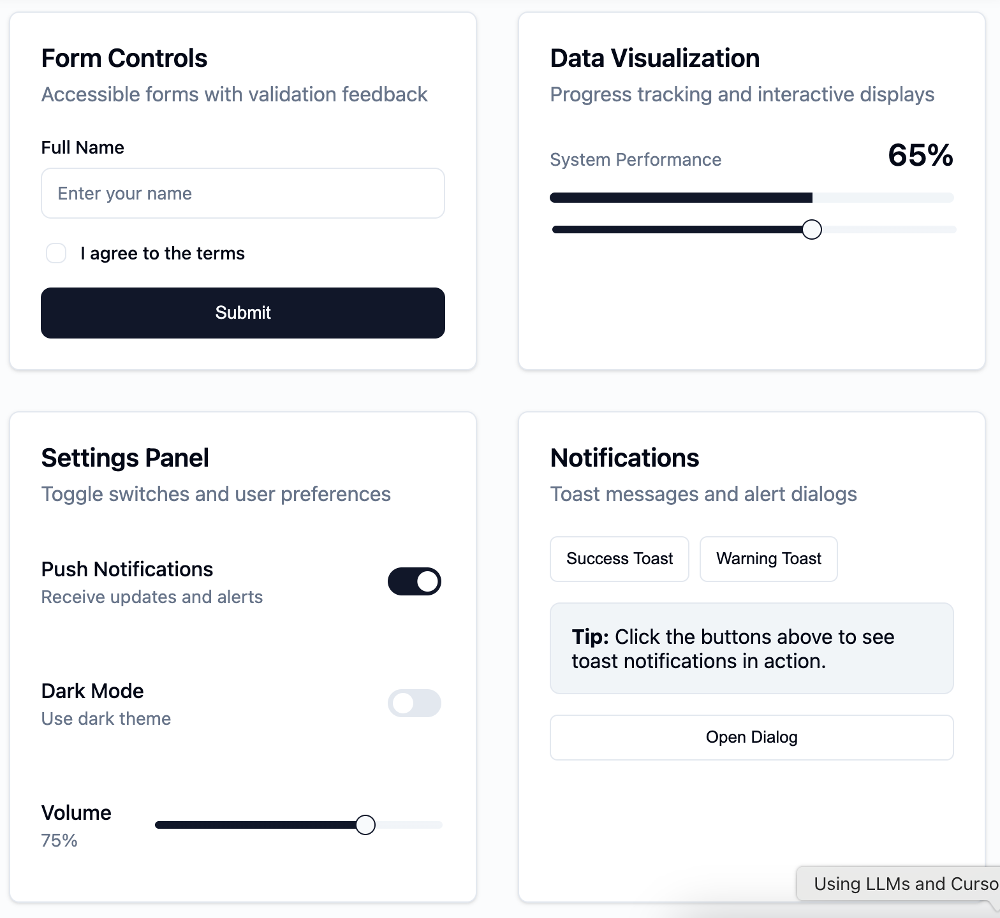

# kinu - Performance-Focused Preact UI Toolkit

A minimal, constraint-driven UI toolkit that enhances HTML instead of replacing it. Built for developers who value performance, simplicity, and the web platform.

## Why kinu?

- **🚀 Tiny Bundle**: ~5KB JS + ~6KB CSS for all components
- **⚡ Zero Re-renders**: No state, direct DOM reactions via native `commandFor` (with fallback)
- **🌐 Platform-Native**: Uses `<dialog>`, form validation, CSS custom properties
- **📦 Tree-Shakeable**: Import only what you use
- **🎨 Beautiful by Default**: Carefully crafted design system

## Screenshot



## Quick Start

```bash
pnpm add kinu
```

```tsx
import { Button, Dialog, Input } from 'kinu';

function App() {
  return (
    <>
      <Button variant="outline" size="lg">
        Click me
      </Button>

      <Dialog>
        <Dialog.Trigger>
          <Button>Open Dialog</Button>
        </Dialog.Trigger>
        <Dialog.Content>
          <h2>Hello World</h2>
          <Input placeholder="Type something..." />
        </Dialog.Content>
      </Dialog>
    </>
  );
}
```

## Live Demo

Check out the [live demo](https://kinu-demo.netlify.app) to see all components in action.

## Documentation

- [Architecture Overview](./ARCHITECTURE.md) - Technical details and design decisions
- [Component Reference](./docs/components.md) - Complete component API documentation

## Development

```bash
# Run the demo app locally
cd demo
pnpm install
pnpm run dev
```

## License

MIT
